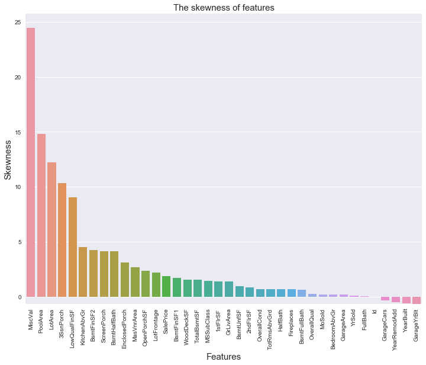

# User Guide to DCW

### 1. Load Data


```python
import DCW.core.load as ld
from DCW.core.load import *
loaddata('train.csv',labellist=['SalePrice'],IDlist=['Id'])
```

>check data


```python
ld.df_train.shape
```


    (1460, 81)


```python
ld.df_train.head(5)
```


<div>
<table border="1" class="dataframe">
  <thead>
    <tr style="text-align: right;">
      <th></th>
      <th>Id</th>
      <th>MSSubClass</th>
      <th>MSZoning</th>
      <th>LotFrontage</th>
      <th>LotArea</th>
      <th>Street</th>
      <th>Alley</th>
      <th>LotShape</th>
      <th>LandContour</th>
      <th>Utilities</th>
      <th>...</th>
      <th>PoolArea</th>
      <th>PoolQC</th>
      <th>Fence</th>
      <th>MiscFeature</th>
      <th>MiscVal</th>
      <th>MoSold</th>
      <th>YrSold</th>
      <th>SaleType</th>
      <th>SaleCondition</th>
      <th>SalePrice</th>
    </tr>
  </thead>
  <tbody>
    <tr>
      <th>0</th>
      <td>1</td>
      <td>60</td>
      <td>RL</td>
      <td>65.0</td>
      <td>8450</td>
      <td>Pave</td>
      <td>NaN</td>
      <td>Reg</td>
      <td>Lvl</td>
      <td>AllPub</td>
      <td>...</td>
      <td>0</td>
      <td>NaN</td>
      <td>NaN</td>
      <td>NaN</td>
      <td>0</td>
      <td>2</td>
      <td>2008</td>
      <td>WD</td>
      <td>Normal</td>
      <td>208500</td>
    </tr>
    <tr>
      <th>1</th>
      <td>2</td>
      <td>20</td>
      <td>RL</td>
      <td>80.0</td>
      <td>9600</td>
      <td>Pave</td>
      <td>NaN</td>
      <td>Reg</td>
      <td>Lvl</td>
      <td>AllPub</td>
      <td>...</td>
      <td>0</td>
      <td>NaN</td>
      <td>NaN</td>
      <td>NaN</td>
      <td>0</td>
      <td>5</td>
      <td>2007</td>
      <td>WD</td>
      <td>Normal</td>
      <td>181500</td>
    </tr>
    <tr>
      <th>2</th>
      <td>3</td>
      <td>60</td>
      <td>RL</td>
      <td>68.0</td>
      <td>11250</td>
      <td>Pave</td>
      <td>NaN</td>
      <td>IR1</td>
      <td>Lvl</td>
      <td>AllPub</td>
      <td>...</td>
      <td>0</td>
      <td>NaN</td>
      <td>NaN</td>
      <td>NaN</td>
      <td>0</td>
      <td>9</td>
      <td>2008</td>
      <td>WD</td>
      <td>Normal</td>
      <td>223500</td>
    </tr>
    <tr>
      <th>3</th>
      <td>4</td>
      <td>70</td>
      <td>RL</td>
      <td>60.0</td>
      <td>9550</td>
      <td>Pave</td>
      <td>NaN</td>
      <td>IR1</td>
      <td>Lvl</td>
      <td>AllPub</td>
      <td>...</td>
      <td>0</td>
      <td>NaN</td>
      <td>NaN</td>
      <td>NaN</td>
      <td>0</td>
      <td>2</td>
      <td>2006</td>
      <td>WD</td>
      <td>Abnorml</td>
      <td>140000</td>
    </tr>
    <tr>
      <th>4</th>
      <td>5</td>
      <td>60</td>
      <td>RL</td>
      <td>84.0</td>
      <td>14260</td>
      <td>Pave</td>
      <td>NaN</td>
      <td>IR1</td>
      <td>Lvl</td>
      <td>AllPub</td>
      <td>...</td>
      <td>0</td>
      <td>NaN</td>
      <td>NaN</td>
      <td>NaN</td>
      <td>0</td>
      <td>12</td>
      <td>2008</td>
      <td>WD</td>
      <td>Normal</td>
      <td>250000</td>
    </tr>
  </tbody>
</table>
<p>5 rows × 81 columns</p>
</div>


```python
ld.quantitative
```


    ['LotFrontage',
     'LotArea',
     'YearBuilt',
     'MasVnrArea',
     'BsmtFinSF1',
     'BsmtFinSF2',
     'BsmtUnfSF',
     'TotalBsmtSF',
     '1stFlrSF',
     '2ndFlrSF',
     'GrLivArea',
     'GarageYrBlt',
     'GarageArea',
     'WoodDeckSF',
     'OpenPorchSF',
     'EnclosedPorch',
     'ScreenPorch']


```python
ld.qualitative
```


    ['MSSubClass',
     'MSZoning',
     'Street',
     'Alley',
     'LotShape',
     'LandContour',
     'Utilities',
     'LotConfig',
     'LandSlope',
     'Neighborhood',
     'Condition1',
     'Condition2',
     'BldgType',
     'HouseStyle',
     'OverallQual',
     'OverallCond',
     'YearRemodAdd',
     'RoofStyle',
     'RoofMatl',
     'Exterior1st',
     'Exterior2nd',
     'MasVnrType',
     'ExterQual',
     'ExterCond',
     'Foundation',
     'BsmtQual',
     'BsmtCond',
     'BsmtExposure',
     'BsmtFinType1',
     'BsmtFinType2',
     'Heating',
     'HeatingQC',
     'CentralAir',
     'Electrical',
     'LowQualFinSF',
     'BsmtFullBath',
     'BsmtHalfBath',
     'FullBath',
     'HalfBath',
     'BedroomAbvGr',
     'KitchenAbvGr',
     'KitchenQual',
     'TotRmsAbvGrd',
     'Functional',
     'Fireplaces',
     'FireplaceQu',
     'GarageType',
     'GarageFinish',
     'GarageCars',
     'GarageQual',
     'GarageCond',
     'PavedDrive',
     '3SsnPorch',
     'PoolArea',
     'PoolQC',
     'Fence',
     'MiscFeature',
     'MiscVal',
     'MoSold',
     'YrSold',
     'SaleType',
     'SaleCondition']


### 2. EDA

>univariable


```python
import DCW.core.EDA.univariable as uv
```


```python
uv.Countplot('RoofStyle')
```


    Gable      1141
    Hip         286
    Flat         13
    Gambrel      11
    Mansard       7
    Shed          2
    Name: RoofStyle, dtype: int64


```python
uv.Describe('SalePrice')
```


    count      1460.000000
    mean     180921.195890
    std       79442.502883
    min       34900.000000
    25%      129975.000000
    50%      163000.000000
    75%      214000.000000
    max      755000.000000
    Name: describe, dtype: float64


```python
uv.Distplot('SalePrice')
```


```python
uv.Skewness()
```





    MiscVal          24.476794
    PoolArea         14.828374
    LotArea          12.207688
    3SsnPorch        10.304342
    LowQualFinSF      9.011341
    KitchenAbvGr      4.488397
    BsmtFinSF2        4.255261
    ScreenPorch       4.122214
    BsmtHalfBath      4.103403
    EnclosedPorch     3.089872
    MasVnrArea        2.669084
    OpenPorchSF       2.364342
    LotFrontage       2.163569
    SalePrice         1.882876
    BsmtFinSF1        1.685503
    WoodDeckSF        1.541376
    TotalBsmtSF       1.524255
    MSSubClass        1.407657
    1stFlrSF          1.376757
    GrLivArea         1.366560
    BsmtUnfSF         0.920268
    2ndFlrSF          0.813030
    OverallCond       0.693067
    TotRmsAbvGrd      0.676341
    HalfBath          0.675897
    Fireplaces        0.649565
    BsmtFullBath      0.596067
    OverallQual       0.216944
    MoSold            0.212053
    BedroomAbvGr      0.211790
    GarageArea        0.179981
    YrSold            0.096269
    FullBath          0.036562
    Id                0.000000
    GarageCars       -0.342549
    YearRemodAdd     -0.503562
    YearBuilt        -0.613461
    GarageYrBlt      -0.649415
    Name: skewness, dtype: float64


```python
uv.Kurtosis()
```


    MiscVal          701.003342
    PoolArea         223.268499
    LotArea          203.243271
    3SsnPorch        123.662379
    LowQualFinSF      83.234817
    KitchenAbvGr      21.532404
    BsmtFinSF2        20.113338
    ScreenPorch       18.439068
    LotFrontage       17.452867
    BsmtHalfBath      16.396642
    TotalBsmtSF       13.250483
    BsmtFinSF1        11.118236
    EnclosedPorch     10.430766
    MasVnrArea        10.082417
    OpenPorchSF        8.490336
    SalePrice          6.536282
    1stFlrSF           5.745841
    GrLivArea          4.895121
    WoodDeckSF         2.992951
    BedroomAbvGr       2.230875
    MSSubClass         1.580188
    OverallCond        1.106413
    GarageArea         0.917067
    TotRmsAbvGrd       0.880762
    BsmtUnfSF          0.474994
    GarageCars         0.220998
    OverallQual        0.096293
    Fireplaces        -0.217237
    MoSold            -0.404109
    GarageYrBlt       -0.418341
    YearBuilt         -0.439552
    2ndFlrSF          -0.553464
    BsmtFullBath      -0.839098
    FullBath          -0.857043
    HalfBath          -1.076927
    YrSold            -1.190601
    Id                -1.200000
    YearRemodAdd      -1.272245
    Name: kurtosis, dtype: float64


>multivariable


```python
import DCW.core.EDA.multivariable as mv
```


```python
mv.Scatterplot(xlabel='GrLivArea',ylabel='SalePrice',color='r')
```


```python
mv.Jointplot(xlabel='GrLivArea',ylabel='SalePrice')
```


```python
mv.Pairplot('GrLivArea','SalePrice',columns=['SalePrice','GrLivArea','BsmtFinSF1'],diag_kind='kde')
```


```python
mv.Correlation('GrLivArea','SalePrice',show_cm=True,zoom=0.3)
```

    Index([u'SalePrice', u'OverallQual', u'GrLivArea', u'GarageCars',
           u'GarageArea', u'TotalBsmtSF', u'1stFlrSF', u'FullBath',
           u'TotRmsAbvGrd', u'YearBuilt', u'YearRemodAdd'],
          dtype='object')
    


    The correlation between features and SalePrice
    


    SalePrice        1.000000
    OverallQual      0.790982
    GrLivArea        0.708624
    GarageCars       0.640409
    GarageArea       0.623431
    TotalBsmtSF      0.613581
    1stFlrSF         0.605852
    FullBath         0.560664
    TotRmsAbvGrd     0.533723
    YearBuilt        0.522897
    YearRemodAdd     0.507101
    GarageYrBlt      0.486362
    MasVnrArea       0.477493
    Fireplaces       0.466929
    BsmtFinSF1       0.386420
    LotFrontage      0.351799
    WoodDeckSF       0.324413
    2ndFlrSF         0.319334
    OpenPorchSF      0.315856
    HalfBath         0.284108
    LotArea          0.263843
    BsmtFullBath     0.227122
    BsmtUnfSF        0.214479
    BedroomAbvGr     0.168213
    ScreenPorch      0.111447
    PoolArea         0.092404
    MoSold           0.046432
    3SsnPorch        0.044584
    BsmtFinSF2      -0.011378
    BsmtHalfBath    -0.016844
    MiscVal         -0.021190
    Id              -0.021917
    LowQualFinSF    -0.025606
    YrSold          -0.028923
    OverallCond     -0.077856
    MSSubClass      -0.084284
    EnclosedPorch   -0.128578
    KitchenAbvGr    -0.135907
    Name: SalePrice, dtype: float64


```python
mv.Barplot(xlabel='MSZoning',ylabel='SalePrice',hue='Fence')
```


```python
mv.Boxplot(xlabel='MSZoning',ylabel='SalePrice',hue='Street')
```


```python
mv.Violinplot(xlabel='MSZoning',ylabel='SalePrice',hue='Street')
```


```python
mv.Pointplot(xlabel='MSZoning',ylabel='SalePrice',hue='Street')
```


```python
mv.Stripplot(xlabel='MSZoning',ylabel='SalePrice',hue='Street')
```


```python
mv.Swarmplot(xlabel='MSZoning',ylabel='SalePrice',hue='Street')
```


```python
mv.Factorplot(xlabel='MSZoning',ylabel='SalePrice',hue='LotShape',col='FullBath',kind='box')
```


### 3.  Missing Value


```python
import DCW.core.missing as ms
```


```python
ms.Missing_Table()
```

                  Total   Percent
    PoolQC         1453  0.995205
    MiscFeature    1406  0.963014
    Alley          1369  0.937671
    Fence          1179  0.807534
    FireplaceQu     690  0.472603
    LotFrontage     259  0.177397
    GarageCond       81  0.055479
    GarageType       81  0.055479
    GarageYrBlt      81  0.055479
    GarageFinish     81  0.055479
    GarageQual       81  0.055479
    BsmtExposure     38  0.026027
    BsmtFinType2     38  0.026027
    BsmtFinType1     37  0.025342
    BsmtCond         37  0.025342
    BsmtQual         37  0.025342
    MasVnrArea        8  0.005479
    MasVnrType        8  0.005479
    Electrical        1  0.000685
    


```python
ms.Missing_Plot()
```


```python
ms.Missing_Process(drop_threshold=0.90,filllist=[],fillnum='mean',fillcat='Missing')
```

    missing data has been processed
    missing data has been processed
    fill none value of categorial data with Missing
    fill none value of categorial data with Missing
    fill none value of numerical data with mean
    fill none value of categorial data with Missing
    fill none value of categorial data with Missing
    fill none value of numerical data with mean
    fill none value of categorial data with Missing
    fill none value of categorial data with Missing
    fill none value of categorial data with Missing
    fill none value of categorial data with Missing
    fill none value of categorial data with Missing
    fill none value of categorial data with Missing
    fill none value of categorial data with Missing
    fill none value of numerical data with mean
    fill none value of categorial data with Missing
    fill none value of categorial data with Missing
    


    ('the features you dropped are ', ['PoolQC', 'MiscFeature', 'Alley'])


```python
print 'after missing process the shape is ',ld.df_train.shape
```

    after missing process the shape is  (1460, 78)
    

### 4. Single Process


```python
import DCW.core.single as sg
sg.single_process(drop_threshold=0.99,single_ratio=0.95,collect=True,show_plot=True,show_table=False,drop=True)
sg.duplicate_process()

print 'after single process the shape is ',ld.df_train.shape
```

    single value ratio count
    {'3SsnPorch': 0.9835616438356164, 'PoolArea': 0.9952054794520548, 'MiscVal': 0.9643835616438357, 'Heating': 0.9780821917808219, 'KitchenAbvGr': 0.9534246575342465, 'Utilities': 0.9993150684931507, 'RoofMatl': 0.9821917808219178, 'Street': 0.9958904109589041, 'LowQualFinSF': 0.9821917808219178, 'Condition2': 0.9897260273972602}
    single value ratio count
    single value ratio count
    


    single value ratio count
    drop over
    no duplicated value exist
    after single process the shape is  (1460, 75)
    

### 5. Outlier Process


```python
import DCW.core.outlier as ot
```


```python
ot.Outlier_collect(feature='GrLivArea',label='SalePrice')
```


    [array([  4676, 184750], dtype=int64), array([  5642, 160000], dtype=int64)]


```python
ot.Outlier_Plot(feature='GrLivArea',label='SalePrice')
```


```python
ot.Outlier_Drop(feature='all',label='SalePrice',method='dropall')
```

    drop outlier of LotFrontage finished
    drop outlier of LotArea finished
    drop outlier of YearBuilt finished
    drop outlier of MasVnrArea finished
    drop outlier of BsmtFinSF1 finished
    drop outlier of BsmtFinSF2 finished
    drop outlier of BsmtUnfSF finished
    drop outlier of TotalBsmtSF finished
    drop outlier of 1stFlrSF finished
    drop outlier of 2ndFlrSF finished
    drop outlier of GrLivArea finished
    drop outlier of GarageYrBlt finished
    drop outlier of GarageArea finished
    drop outlier of WoodDeckSF finished
    drop outlier of OpenPorchSF finished
    drop outlier of EnclosedPorch finished
    drop outlier of ScreenPorch finished
    


```python
print 'after outlier process the shape is ',ld.df_train.shape
```

    after outlier process the shape is  (1403, 75)
    
